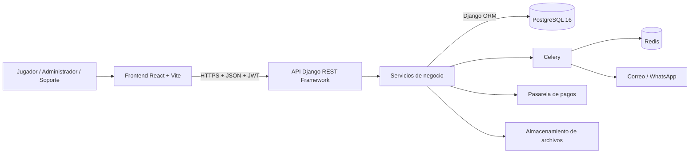

# Arquitectura de LuxxitoSports

## Objetivo

LuxxitoSports centraliza la consulta de disponibilidad, el bloqueo temporal de
horarios, las reservas, los pagos y la operacion de complejos deportivos. El
diseno busca evitar reservas duplicadas, mantener consistencia transaccional y
permitir el crecimiento a multiples complejos.

## Arquitectura de tres capas

### Presentacion

Ubicacion: `frontend/`.

- React 18, TypeScript y Vite.
- Tailwind CSS, shadcn/ui y Radix UI.
- React Router con guardas para jugador, administrador y soporte.
- Recharts para indicadores.
- Comunicacion futura con la API mediante HTTPS y JSON.
- El token JWT debe mantenerse en memoria o mediante una estrategia segura; no
  debe persistirse informacion sensible en `localStorage`.

### Logica de negocio

Ubicacion prevista: `backend/`.

- Django y Django REST Framework.
- Serializers para validar entradas y transformar modelos a JSON.
- ViewSets o vistas de API para exponer recursos REST.
- JWT y permisos por rol en cada operacion protegida.
- Servicios de dominio:
  - `ReservationService`: bloqueos y reservas con transacciones.
  - `PaymentService`: pagos y comprobantes manuales.
  - `PricingService`: tarifas por cancha, dia y horario.
  - `NotificationService`: confirmaciones y recordatorios.
  - `ScoringService`: clientes nuevos, frecuentes y VIP.
- Celery y Redis para liberar bloqueos expirados y enviar notificaciones.

### Datos

- PostgreSQL 16 y Django ORM.
- Transacciones ACID para confirmar reservas y pagos.
- Bloqueo pesimista con `SELECT ... FOR UPDATE`.
- Indices por cancha, fecha y rango horario.
- Aislamiento de datos por complejo deportivo.
- Archivos de comprobantes en almacenamiento privado local o cloud.

## Flujo critico de reserva

1. El frontend consulta `GET /api/canchas/disponibilidad/`.
2. El jugador selecciona cancha, fecha, horario y extras.
3. El backend abre una transaccion, valida cruces y crea un bloqueo de 20
   minutos.
4. El jugador paga con tarjeta o carga un comprobante manual.
5. Un pago aprobado convierte el bloqueo en reserva confirmada.
6. Celery envia la confirmacion y programa el recordatorio de 24 horas.
7. Si el pago no llega a tiempo, Celery expira el bloqueo y libera el horario.

Un intento concurrente sobre el mismo horario debe responder `409 Conflict`.

## Reglas principales

- Un bloqueo sin pago expira a los 20 minutos.
- No se confirma una reserva sin pago aprobado o validado manualmente.
- Solo puede existir un bloqueo activo o reserva confirmada por cancha y
  horario.
- Una cancelacion con al menos 24 horas de anticipacion permite reembolso.
- Los precios usan la regla activa; en su ausencia, la tarifa estandar.
- Solo pueden reservarse extras operativos y con stock.
- Un administrador no puede cerrar un horario con reserva confirmada.

## Estado de implementacion

El frontend ya representa los principales flujos, pero actualmente usa mocks y
`localStorage`. La API, PostgreSQL, Celery, Redis, pagos y notificaciones son
componentes objetivo y deben implementarse en `backend/`.

