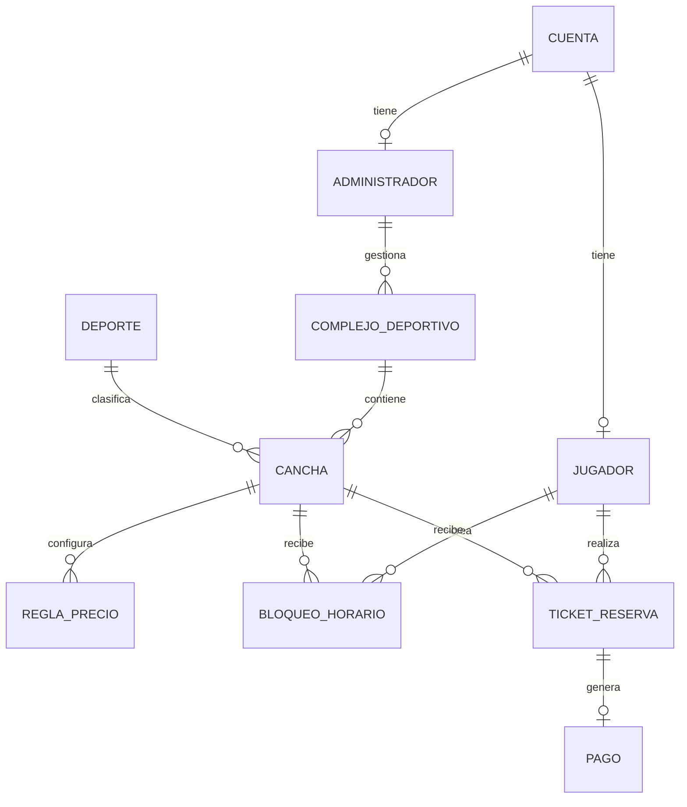

# Modelo de base de datos

## Tecnologia

- PostgreSQL 16
- Django ORM y migraciones
- UUID para entidades principales
- Restricciones `PK`, `FK`, `UNIQUE` y `CHECK`
- Transacciones ACID para bloqueo, reserva y pago

## Diagrama relacional



## Tablas

### `cuenta`

| Campo | Tipo | Restricciones |
| --- | --- | --- |
| `id_cuenta` | UUID | PK |
| `correo` | VARCHAR(255) | UNIQUE, NOT NULL |
| `clave_hash` | VARCHAR(255) | NOT NULL |
| `rol` | VARCHAR(20) | JUGADOR, ADMINISTRADOR o SOPORTE |
| `activo` | BOOLEAN | DEFAULT TRUE |
| `creado_en` | TIMESTAMP | NOT NULL |

### `jugador`

| Campo | Tipo | Restricciones |
| --- | --- | --- |
| `id_jugador` | UUID | PK |
| `id_cuenta` | UUID | FK, UNIQUE, NOT NULL |
| `nombre_completo` | VARCHAR(150) | NOT NULL |
| `telefono` | VARCHAR(15) | NULL |
| `puntos_ranking` | INTEGER | DEFAULT 0, CHECK >= 0 |

### `administrador`

| Campo | Tipo | Restricciones |
| --- | --- | --- |
| `id_administrador` | UUID | PK |
| `id_cuenta` | UUID | FK, UNIQUE, NOT NULL |
| `ruc_dni` | VARCHAR(11) | UNIQUE, NOT NULL |
| `nombre_comercial` | VARCHAR(150) | NOT NULL |
| `verificado` | BOOLEAN | DEFAULT FALSE |

### `complejo_deportivo`

| Campo | Tipo | Restricciones |
| --- | --- | --- |
| `id_complejo` | UUID | PK |
| `id_administrador` | UUID | FK, NOT NULL |
| `nombre` | VARCHAR(150) | NOT NULL |
| `direccion` | VARCHAR(255) | NOT NULL |
| `ciudad` | VARCHAR(100) | NOT NULL |
| `coordenadas` | POINT | NULL |
| `activo` | BOOLEAN | DEFAULT TRUE |

### `deporte`

| Campo | Tipo | Restricciones |
| --- | --- | --- |
| `id_deporte` | SERIAL | PK |
| `nombre` | VARCHAR(50) | UNIQUE, NOT NULL |

### `cancha`

| Campo | Tipo | Restricciones |
| --- | --- | --- |
| `id_cancha` | UUID | PK |
| `id_complejo` | UUID | FK, NOT NULL |
| `id_deporte` | INTEGER | FK, NOT NULL |
| `nombre` | VARCHAR(100) | NOT NULL |
| `tipo_superficie` | VARCHAR(30) | CHECK de catalogo |
| `techada` | BOOLEAN | DEFAULT FALSE |
| `iluminacion` | BOOLEAN | DEFAULT FALSE |
| `activa` | BOOLEAN | DEFAULT TRUE |

### `regla_precio`

| Campo | Tipo | Restricciones |
| --- | --- | --- |
| `id_regla` | UUID | PK |
| `id_cancha` | UUID | FK, NOT NULL |
| `dia_semana` | SMALLINT | CHECK entre 1 y 7 |
| `hora_inicio` | TIME | NOT NULL |
| `hora_fin` | TIME | CHECK fin > inicio |
| `monto_hora` | DECIMAL(10,2) | CHECK > 0 |

Unicidad: cancha, dia, hora de inicio y hora de fin.

### `bloqueo_horario`

| Campo | Tipo | Restricciones |
| --- | --- | --- |
| `id_bloqueo` | UUID | PK |
| `id_cancha` | UUID | FK, NOT NULL |
| `id_jugador` | UUID | FK, NOT NULL |
| `fecha` | DATE | NOT NULL |
| `hora_inicio` | TIME | NOT NULL |
| `hora_fin` | TIME | CHECK fin > inicio |
| `estado` | VARCHAR(20) | ACTIVO, EXPIRADO, CONVERTIDO o CANCELADO |
| `creado_en` | TIMESTAMP | NOT NULL |
| `expira_en` | TIMESTAMP | CHECK expira > creacion |

### `ticket_reserva`

| Campo | Tipo | Restricciones |
| --- | --- | --- |
| `id_ticket` | UUID | PK |
| `id_jugador` | UUID | FK, NOT NULL |
| `id_cancha` | UUID | FK, NOT NULL |
| `fecha_programada` | DATE | NOT NULL |
| `hora_inicio` | TIME | NOT NULL |
| `hora_fin` | TIME | CHECK fin > inicio |
| `estado` | VARCHAR(20) | PENDIENTE, CONFIRMADA, CANCELADA o VENCIDA |
| `precio_total` | DECIMAL(10,2) | CHECK >= 0 |
| `creado_en` | TIMESTAMP | NOT NULL |
| `actualizado_en` | TIMESTAMP | NOT NULL |

### `pago`

| Campo | Tipo | Restricciones |
| --- | --- | --- |
| `id_pago` | UUID | PK |
| `id_ticket` | UUID | FK, UNIQUE, NOT NULL |
| `metodo` | VARCHAR(30) | Catalogo de metodos |
| `referencia` | VARCHAR(255) | NULL |
| `monto_pagado` | DECIMAL(10,2) | CHECK >= 0 |
| `estado` | VARCHAR(20) | PENDIENTE, APROBADO, FALLIDO o REEMBOLSADO |
| `fecha_pago` | TIMESTAMP | NULL |

## Integridad y concurrencia

Un rango se cruza con otro cuando:

```sql
hora_inicio < nueva_hora_fin
AND hora_fin > nueva_hora_inicio
```

La creacion del bloqueo debe ejecutarse dentro de `transaction.atomic()` y
usar `select_for_update()` sobre los recursos del horario. PostgreSQL puede
reforzar la regla con un `ExclusionConstraint` sobre un rango temporal para
bloqueos activos y reservas confirmadas.

## Indices recomendados

| Tabla | Columnas |
| --- | --- |
| `cuenta` | `correo` |
| `cancha` | `id_complejo, id_deporte` |
| `regla_precio` | `id_cancha, dia_semana` |
| `bloqueo_horario` | `id_cancha, fecha, hora_inicio, hora_fin` |
| `ticket_reserva` | `id_cancha, fecha_programada` |
| `ticket_reserva` | `id_jugador, fecha_programada` |
| `pago` | `id_ticket` y `estado` |

